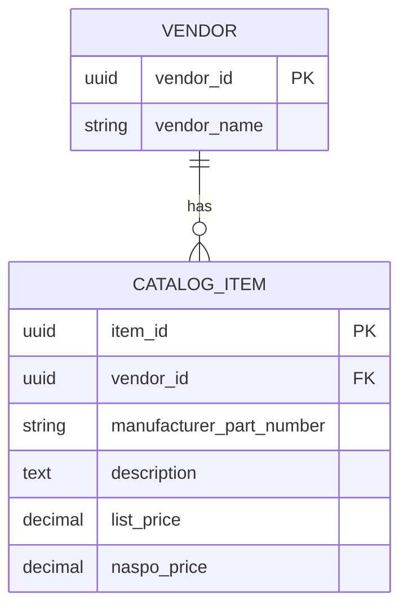

```mermaid
erDiagram
    VENDOR {
        uuid vendor_id PK
        string vendor_name
    }

    CATALOG_ITEM {
        uuid item_id PK
        uuid vendor_id FK
        string manufacturer_part_number
        text description
        decimal list_price
        decimal naspo_price
    }

    VENDOR ||--o{ CATALOG_ITEM : has
```